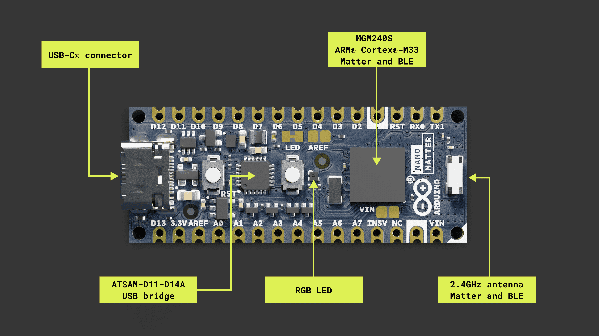

# Session 01 — What is bare metal?

> **Goal:** build a mental model of what a microcontroller actually is, what "bare metal" means, and where assembly fits in.

No code in this session — just pictures and ideas. Sessions 2 and 3 still set things up. The first time you see the LED blink is **Session 7**. Stay with me.

---

## A microcontroller is a tiny computer

Your laptop has a CPU, some RAM, some storage (SSD), and a bunch of peripherals (Wi-Fi, USB, screen). A **microcontroller** (MCU) is the same idea, shrunk into one chip:

Inside that little black square in the middle (the EFR32MG24 module) live a CPU, flash memory (1536 kB — where your program goes), RAM (256 kB — where your variables and stack live), and a pile of peripherals (GPIO, USART, timers, radio…) all wired together on an internal bus.

The Nano Matter board adds a USB-C connector, a debug chip (J-Link OB), an LED, a button, and some passive components. That's it. There is no operating system. There is no Python interpreter. There isn't even a C library unless you bring one yourself.

> **Jargon:** **MCU** = microcontroller unit. We'll use "MCU", "chip", and "microcontroller" interchangeably.

---

## What does "bare metal" mean?

Imagine ordering pizza:

- **Cloud / Linux app**: you tell a website you're hungry. Many layers handle the rest.
- **Arduino sketch**: you call `digitalWrite(LED, HIGH)`. The Arduino library figures out which pin, which register, which clock to enable.
- **Bare metal**: you walk into the kitchen, knead the dough, write the bytes that turn on the LED **directly into the chip's registers**. No middleman.

Bare-metal programming means: **you are the only software running on the chip.** When you press reset, your code is the first and only thing the CPU executes.

> **Why?:** Because it's the *only* way to truly understand what's going on. Every Arduino library, every RTOS, every C runtime — they all eventually do what you'll do by hand in this series.

---

## Why assembly?

You *could* write bare metal in C. We'll get there eventually. But assembly has one superpower: **there is nothing between you and the chip.** Each line you write turns into one instruction the CPU executes. Nothing is hidden.

A C compiler is helpful, but it's also a thick book of "well, actually". Assembly is the rulebook itself.

> **Jargon:** **Assembly** is a human-readable form of machine code. `mov r0, #1` is assembly. The assembler turns it into the bytes `0x01 0x20` that the chip actually runs.

---

## What our specific chip is

The Arduino Nano Matter is built around the **Silicon Labs MGM240SD22VNA**, which is a wireless module wrapping an **EFR32MG24** SoC. Inside the EFR32MG24 is an **ARM Cortex-M33** processor.

Two facts to remember:

1. **It's a Cortex-M33** — a 32-bit ARMv8-M Mainline core.
2. **It only speaks Thumb.** Not classic 32-bit ARM mode. Every instruction we write will be 16 or 32 bits of Thumb-2.

If you've seen older ARM tutorials with `mov r0, #1` outside a `.thumb` block, that's classic ARM. We won't be using that. Everything in this series is Thumb.

> **Gotcha:** If you ever assemble a program and the chip immediately crashes / hardfaults, the #1 cause for beginners is forgetting to mark a function as Thumb. We'll fix this once and forget about it in Session 4.

---

## A tour of the Nano Matter

Find these on the board (you'll need them later):

- **USB-C connector** — power, programming, and debugging all happen through here.
- **Reset button** — the small one. Press it and your program restarts from scratch.
- **User pushbutton (BTN_BUILTIN)** — labelled `USR` on most board photos. Wired to GPIO pin **PA0**, active low (pressed = 0).
- **On-board RGB LED** — three LEDs in one package:
  - Red on **PC1** (active low — write 0 to turn ON)
  - Green on **PC2** (active low)
  - Blue on **PC3** (active low)
- The headers around the edge are 14 digital pins + 8 analog pins, but we won't touch those until much later (if at all).

> **Jargon:** **GPIO** = General-Purpose Input/Output. A pin you can configure to be either an input you read, or an output you drive high or low. The Nano Matter has 22 of them brought out to the headers.

> **Jargon:** **Active low** means the LED turns ON when the pin is at 0 V (LOW), and OFF at 3.3 V (HIGH). It's wired this way so the chip *sinks* current rather than sourcing it. Don't worry about why for now; just remember: 0 = on, 1 = off.

---

## What "running a program" actually means

This part trips up beginners, so let's be explicit. When you "flash" a program onto the Nano Matter:

1. The bytes of your compiled program get written into the chip's **flash memory**, starting at address `0x08000000`.
2. When you press reset, the CPU looks at the **first 8 bytes** of flash:
   - bytes 0–3: the initial value of the **stack pointer** (where to put RAM-based scratch space).
   - bytes 4–7: the address of the **reset handler** (your "main" function).
3. The CPU loads those, jumps to the reset handler, and starts executing your code one instruction at a time.

That's it. There's no boot screen. There's no OS. The first instruction the CPU runs is the one you wrote.

We'll see this with our own eyes in Session 3 (the vector table) and Session 4 (the first program).

---

## Try it (no chip required)

Open `Tutorials/BareMetalAssembly/Intro.md` and re-read the **12-session syllabus**. For each session, ask yourself: "what's new here that I don't already understand?" That's a good way to see the shape of what's coming.

---

## What you should remember from this session

- A microcontroller = tiny computer with CPU + flash + RAM + peripherals, all in one chip.
- "Bare metal" = no OS, no libraries, just your code.
- The Nano Matter uses a Cortex-M33 core that only runs **Thumb** instructions.
- Reset = "look at the first 8 bytes of flash, jump there".
- LEDs are on **PC1/PC2/PC3** (active low). Button is on **PA0**.

---

➡️ **Next:** [Session 02 — macOS toolchain setup](../02-toolchain-setup/)
